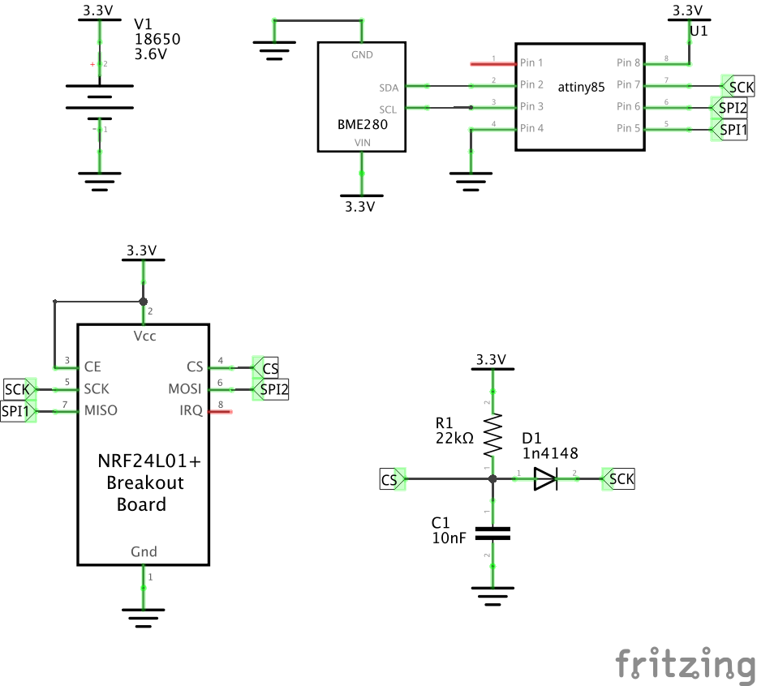

# TinyBME - ATTiny85/NRF24l01/BME280 (I2C) Mysensors Node

**Work in progress... Proceed with caution.**

Right now (mid-2020) there is no any info how to build [MySensors](http://mysensors.org/) node on ATTiny85 with NRF24l01 and BME280 (4pin I2C version). This projects proves it is possible.

I've just started to work with ATTiny85 platform and decided to find if it is possible to build basic MySensors node with temperature sensor.

NRF24L01 requires 5 pins for work. Considering that ATTiny85 has 5 usable pins in total this leaves no space to connect anything else. By connecting CE pin of NRF24L01 directly to VCC and multiplexing CS pin via SCK you can make it work with only 3 pins. Here are the projects I used: [1](http://nerdralph.blogspot.com/2014/01/nrf24l01-control-with-3-attiny85-pins.html) [2](https://www.instructables.com/id/NRF24L01-With-ATtiny85-3-Pins/)

This leaves us pins 3 and 4 to connect sensors. If you have BME280 that works with SPI it shouldn't be a problem and this [was done before](https://forum.mysensors.org/topic/10866/a-tiny-bme-node-bme280-on-attiny85). However 4-pin version of BME280 sensors I had works only over I2C.  Unfortunately ATTiny85 shares SPI and I2C pins. So I had to use SoftWire to move I2C functionality to pins 3 and 4.

The smallest BME280/I2C library [TinyBME280](https://github.com/technoblogy/tiny-bme280) adapted for ATTiny85 doesn't work with SoftWire out of box. To simplify adoption process and save some space I converted it to .h file and included into this project.

Another challenge is Flash. Right now code is 92 bytes under 8K. Which leaves no space even to do proper conversion of BME280 output. This should be done in your controller, for example HomeAssistant.
```
RAM:   [=======   ]  70.7% (used 362 bytes from 512 bytes)
Flash: [==========]  98.9% (used 8100 bytes from 8192 bytes)
```

## Schematics




## Code

*Right now this is very rough set of instructions. More like hints. I assume you are familar with [MySensors platform](https://mysensors.org/).*

- Clone the repo
- Patch mysensors library: `patch -p0 <mysensors.diff` - patch contains number of fixes required to make MySensors library work on ATTiny85 and for 3-pin setup.
- Make sure you have your Arduino ISP setup ready. [Here is good instructions how to make it work with Pro Micro](https://www.instructables.com/id/Mini-Breadboard-Pro-Micro-ISP-for-DIP8-ATTiny-Seri/)
- Fix serial port in `platformio.ini`
- Fix `MY_NODE_ID` and `MY_RF24_CHANNEL` in `src/main.cpp`
- [Fix BME280 I2C address if needed](include/TinyBME280.h#L16)
- `pio run --target upload`


## Sample gateway output

```
93735210 TSF:MSG:READ,99-99-0,s=255,c=3,t=15,pt=6,l=2,sg=0:0100
93735231 TSF:MSG:SEND,0-0-99-99,s=255,c=3,t=15,pt=6,l=2,sg=0,ft=0,st=OK:0100
93735238 TSF:MSG:READ,99-99-0,s=255,c=0,t=17,pt=0,l=5,sg=0:2.3.2
93735245 TSF:MSG:READ,99-99-0,s=255,c=3,t=6,pt=1,l=1,sg=0:255
93737232 TSF:MSG:READ,99-99-0,s=255,c=3,t=11,pt=0,l=7,sg=0:TinyBME
93737239 TSF:MSG:READ,99-99-0,s=255,c=3,t=12,pt=0,l=3,sg=0:0.3
93737246 TSF:MSG:READ,99-99-0,s=0,c=0,t=6,pt=0,l=0,sg=0:
93737252 TSF:MSG:READ,99-99-0,s=1,c=0,t=8,pt=0,l=0,sg=0:
93737258 TSF:MSG:READ,99-99-0,s=2,c=0,t=7,pt=0,l=0,sg=0:
93738392 TSF:MSG:READ,99-99-0,s=0,c=1,t=0,pt=5,l=4,sg=0:2210
93738528 TSF:MSG:READ,99-99-0,s=1,c=1,t=4,pt=5,l=4,sg=0:98085
93738664 TSF:MSG:READ,99-99-0,s=2,c=1,t=1,pt=5,l=4,sg=0:4401
```


## Credits

This project is just a compilation of work that was done before. Here is list of resources:

* https://forum.mysensors.org/topic/10866/a-tiny-bme-node-bme280-on-attiny85
* http://nerdralph.blogspot.com/2014/01/nrf24l01-control-with-3-attiny85-pins.html
* https://www.instructables.com/id/NRF24L01-With-ATtiny85-3-Pins/
* https://github.com/technoblogy/tiny-bme280
